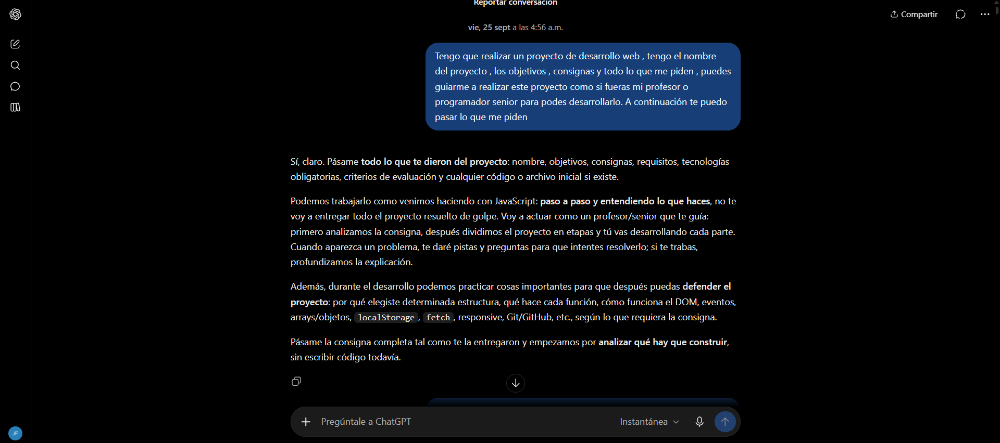
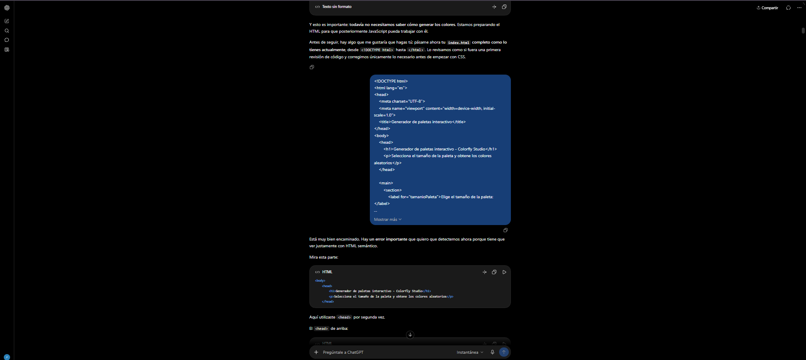
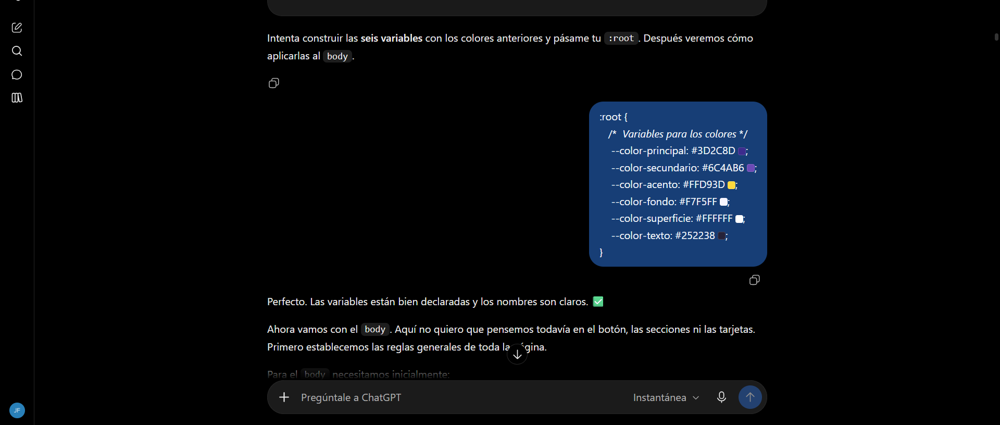
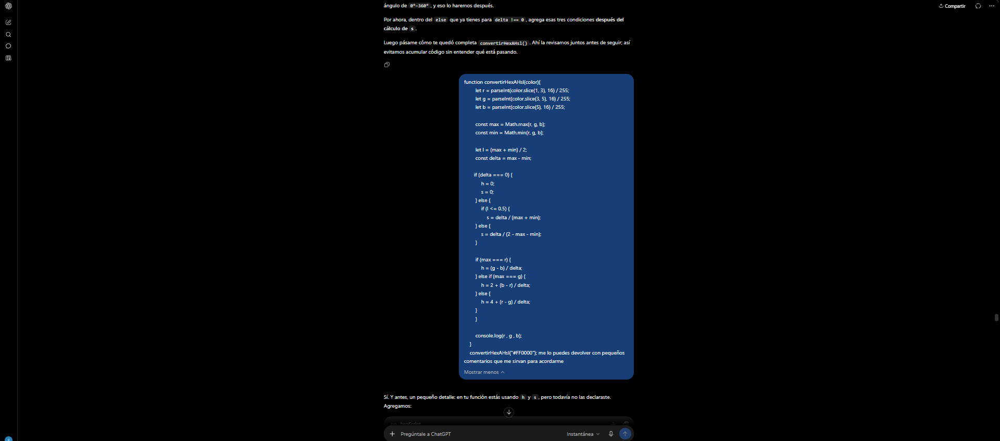
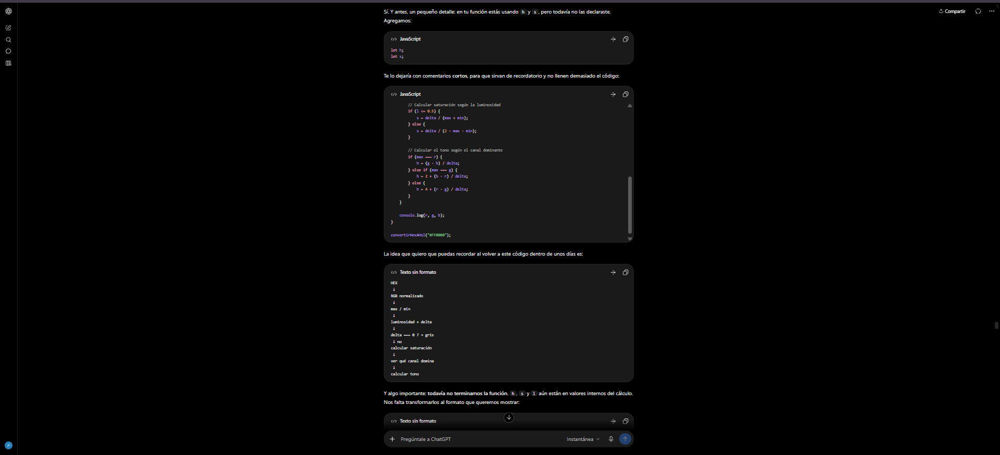
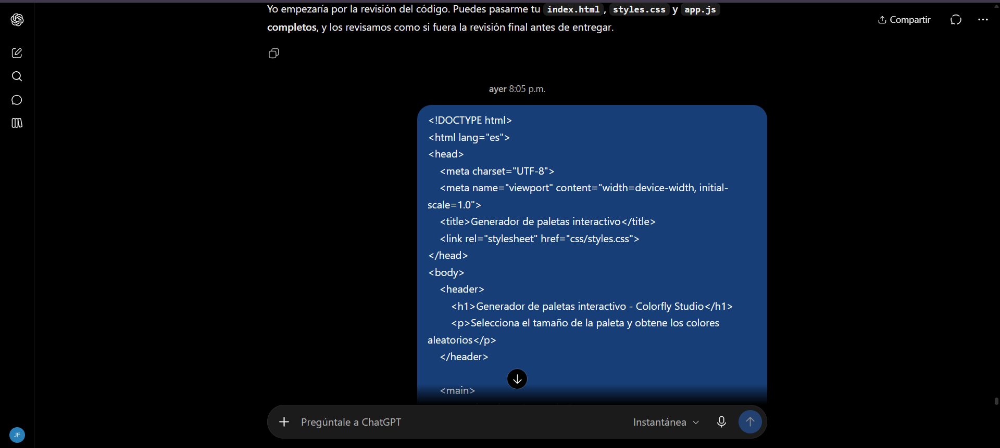
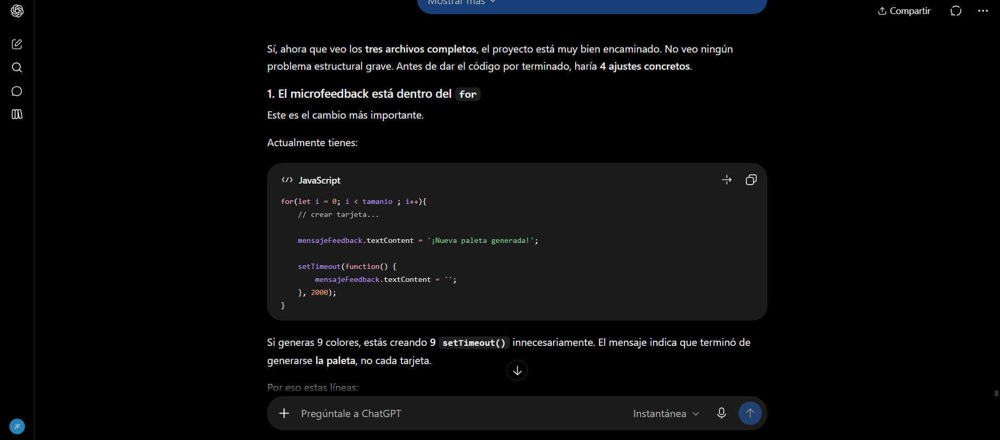
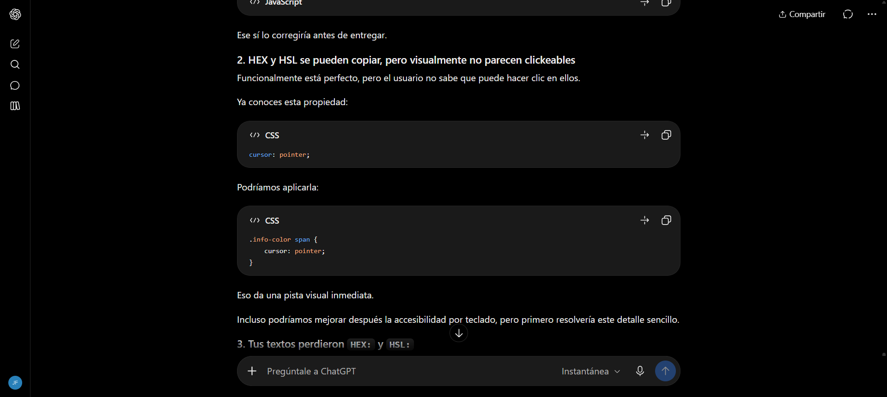
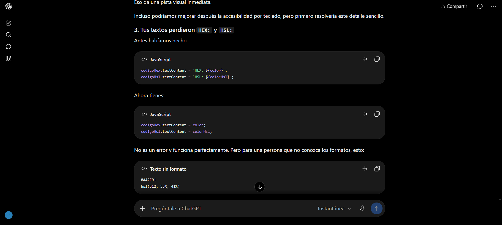
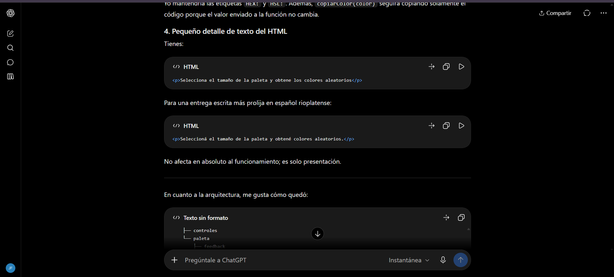

# Documentación del uso de Inteligencia Artificial

Este documento presenta las principales consultas
realizadas a ChatGPT durante el desarrollo del
Generador de Paletas Interactivo de Colorfly Studio.

La metodología consistió en desarrollar el código
de manera incremental y utilizar la IA para recibir
orientación, explicaciones y revisiones.

- Herramienta utilizada: ChatGPT (OpenAI).

## Consulta 1: Orientación inicial del proyecto

**Objetivo de la consulta:**

Solicitar orientación para desarrollar un proyecto web, utilizando la inteligencia artificial como tutor de programación y acompañamiento durante las distintas etapas del desarrollo.

**Prompt utilizado:**

Tengo que realizar un proyecto de desarrollo web , tengo el nombre del proyecto , los objetivos , consignas y todo lo que me piden , puedes guiarme a realizar este proyecto como si fueras mi profesor o programador senior para podes desarrollarlo. A continuación te puedo pasar lo que me piden

**Resultado obtenido:**

Se estableció una metodología de trabajo basada en el acompañamiento paso a paso, la explicación de conceptos y la revisión del código desarrollado.

**Influencia en el desarrollo:**

Esta consulta permitió organizar el proceso de aprendizaje y desarrollo del Generador de Paletas Interactivo, utilizando ChatGPT como herramienta de orientación para tomar decisiones técnicas y resolver dudas.

**Evidencia:**



## Consulta 2: Revisión de la estructura HTML

**Objetivo de la consulta:**

Revisar la estructura HTML inicial del Generador de Paletas Interactivo para identificar posibles errores y mejorar el uso de etiquetas semánticas.

**Prompt utilizado:**

Se compartió con ChatGPT el código HTML inicial de la aplicación para recibir orientación y correcciones.

El mensaje original completo se encuentra en la captura de pantalla adjunta.

**Resultado obtenido:**

Durante la revisión se identificó el uso incorrecto de la etiqueta <head> dentro del <body>, donde correspondía utilizar la etiqueta semántica <header>.

Se comprendió la diferencia entre ambas etiquetas y su función dentro de un documento HTML.

**Influencia en el desarrollo:**

Se corrigió la estructura HTML de la aplicación, utilizando <header> para la cabecera visible del sitio y manteniendo <main> y <section> para organizar el contenido principal.

Esta revisión permitió mejorar la estructura semántica del proyecto.

**Evidencia:**



## Consulta 3: Definición de variables CSS

**Objetivo de la consulta:**

Definir una paleta de colores para la interfaz del Generador de Paletas Interactivo y organizar los estilos mediante propiedades personalizadas de CSS.

**Prompt utilizado:**

Se compartió con ChatGPT el siguiente código CSS para su revisión:
```css
:root {
    /* Variables para los colores */
    --color-principal: #3D2C8D;
    --color-secundario: #6C4AB6;
    --color-acento: #FFD93D;
    --color-fondo: #F7F5FF;
    --color-superficie: #FFFFFF;
    --color-texto: #252238;
}
```

**Resultado obtenido:**

La consulta permitió continuar trabajando en la organización de los estilos y comprender cómo reutilizar los colores definidos en :root mediante la función var().

**Influencia en el desarrollo:**

Las variables se incorporaron a la hoja de estilos para mantener una identidad visual consistente y facilitar los cambios de colores en diferentes elementos de la interfaz.

**Evidencia:**



## Consulta 4: Revisión de la función de conversión HEX a HSL

**Objetivo de la consulta:**

Revisar la implementación de la función convertirHexAHsl() y agregar comentarios breves que facilitaran la comprensión de cada operación.

**Prompt utilizado**

Se compartió el código JavaScript de la función convertirHexAHsl() y se realizó la siguiente solicitud:

"me lo puedes devolver con pequeños comentarios que me sirvan para acordarme"

El código compartido incluía la conversión de HEX a RGB, la normalización de los valores y los cálculos iniciales de luminosidad, saturación y tono.

**Resultado obtenido**

Durante la revisión, ChatGPT identificó que las variables h y s se estaban utilizando sin haber sido declaradas.

Se sugirió incorporar:

let h;
let s;

Además, se agregaron comentarios explicativos para recordar las distintas etapas del algoritmo:

Conversión de HEX a RGB.

Normalización de los valores entre 0 y 1.

Identificación de los valores máximo y mínimo.

Cálculo de luminosidad y saturación.

Cálculo del tono según el canal RGB dominante.

También se explicó que la función todavía necesitaba transformar los resultados al formato final hsl(H, S%, L%).

**Influencia en el desarrollo**

La revisión permitió identificar un error en la declaración de variables y mejorar la comprensión del algoritmo.

Posteriormente, se completó la función para obtener los valores HSL y utilizarlos en las tarjetas de colores generadas dinámicamente.

**Evidencias**




## Consulta 5: Revisión general del proyecto

Objetivo de la consulta:

Realizar una revisión general de los archivos HTML, CSS y JavaScript antes de finalizar el proyecto, con el propósito de identificar errores y posibles mejoras.

**Prompt utilizado:**

Se compartieron los archivos completos index.html, styles.css y app.js con ChatGPT, siguiendo su propuesta de realizar una revisión final del código antes de la entrega.
El mensaje original completo se encuentra en la captura de pantalla adjunta.

**Resultados obtenidos:**

Durante la revisión, ChatGPT identificó cuatro aspectos que podían mejorarse:

Microfeedback: el mensaje de confirmación estaba dentro del ciclo for, provocando la creación innecesaria de varios temporizadores setTimeout().

Interacción con los códigos: se recomendó utilizar cursor: pointer para indicar que los códigos HEX y HSL podían copiarse.

Identificación de formatos: se sugirió incorporar las etiquetas HEX: y HSL: para facilitar la comprensión de los códigos.

Redacción: se recomendó mejorar el texto descriptivo del encabezado de la aplicación.

**Influencia en el desarrollo**

A partir de la revisión, se realizaron ajustes en JavaScript, CSS y HTML.

Se trasladó el mensaje de confirmación fuera del ciclo for, se mejoró la identificación visual de los códigos copiables y se realizaron pequeños ajustes en los textos de la interfaz.

Estas modificaciones permitieron mejorar la organización del código y la experiencia de uso de la aplicación.

**Evidencias:**





